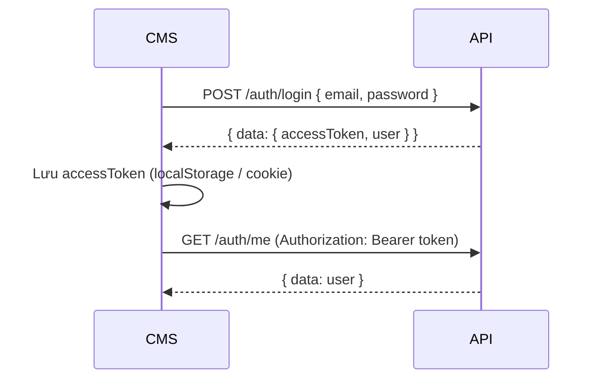
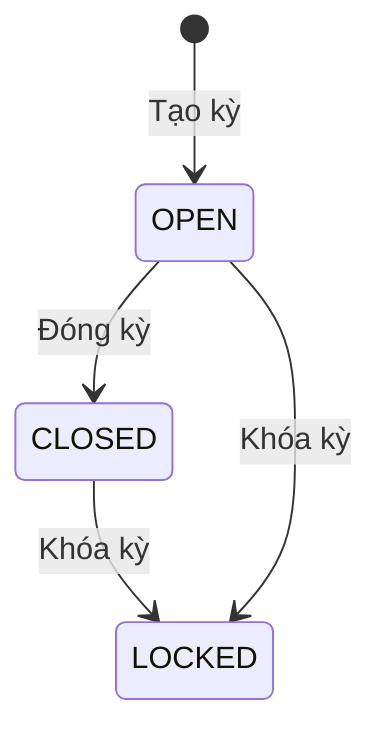

# Tài liệu API triển khai CMS — Quản lý KPI

**Phiên bản:** 1.0  
**Đối tượng:** Frontend / CMS developer  
**Base URL mặc định:** `http://localhost:3000/api` (hoặc theo `PORT` trong `.env`, ví dụ `1111`)

> Tài liệu kỹ thuật backend đầy đủ: [`documents.md`](./documents.md)  
> Swagger tương tác: `http://localhost:{PORT}/api/docs`

---

## Mục lục

1. [Khởi động nhanh](#1-khởi-động-nhanh)
2. [Quy ước tích hợp](#2-quy-ước-tích-hợp)
3. [Xác thực CMS](#3-xác-thực-cms)
4. [Ánh xạ màn hình CMS → API](#4-ánh-xạ-màn-hình-cms--api)
5. [API Reference](#5-api-reference)
6. [Logic nghiệp vụ cho UI](#6-logic-nghiệp-vụ-cho-ui)
7. [Gợi ý tích hợp Frontend](#7-gợi-ý-tích-hợp-frontend)
8. [TypeScript types tham khảo](#8-typescript-types-tham-khảo)

---

## 1. Khởi động nhanh

```bash
# Backend
npm install
npm run dev

# Seed dữ liệu ban đầu
npm run seed:all
```

| Thông tin | Giá trị |
|-----------|---------|
| API | `http://localhost:{PORT}/api` |
| Swagger | `http://localhost:{PORT}/api/docs` |
| Health | `GET /api/health` |
| Admin (sau seed) | `admin@example.com` / `Admin@123` |

---

## 2. Quy ước tích hợp

### 2.1. Headers

| Header | Khi nào dùng | Giá trị |
|--------|--------------|---------|
| `Content-Type` | Request có body JSON | `application/json` |
| `Authorization` | Endpoint cần đăng nhập | `Bearer <accessToken>` |

### 2.2. Response thành công

**Một object:**

```json
{
  "data": { "id": "...", "fullName": "..." }
}
```

**Danh sách có phân trang:**

```json
{
  "data": [ ... ],
  "meta": {
    "page": 1,
    "limit": 20,
    "total": 100,
    "totalPages": 5
  }
}
```

### 2.3. Response lỗi

```json
{
  "statusCode": 400,
  "message": "Kỳ KPI đã khóa hoặc đã đóng",
  "error": "Bad Request",
  "path": "/api/kpi-events",
  "timestamp": "2026-06-11T13:37:10.033Z"
}
```

| statusCode | Ý nghĩa CMS |
|------------|-------------|
| `400` | Dữ liệu / nghiệp vụ không hợp lệ — hiển thị `message` |
| `401` | Chưa login hoặc token hết hạn — redirect login |
| `403` | Không đủ quyền (không phải ADMIN) |
| `404` | Không tìm thấy bản ghi |
| `409` | Trùng email / mã nhân viên / kỳ KPI |

### 2.4. Query phân trang (dùng chung)

| Param | Mặc định | Mô tả |
|-------|----------|--------|
| `page` | `1` | Trang hiện tại |
| `limit` | `20` | Số bản ghi/trang (max `100`) |
| `sortBy` | `createdAt` | Trường sắp xếp |
| `sortOrder` | `desc` | `asc` hoặc `desc` |
| `keyword` | — | Tìm kiếm (hỗ trợ tùy module) |

---

## 3. Xác thực CMS

### 3.1. Luồng đăng nhập



### 3.2. POST `/auth/login` — Public

**Request:**

```json
{
  "email": "admin@example.com",
  "password": "Admin@123"
}
```

**Response `200`:**

```json
{
  "data": {
    "accessToken": "eyJhbGciOiJIUzI1NiIs...",
    "user": {
      "id": "6a2aba5bc1a594177eaced93",
      "employeeCode": "ADMIN001",
      "fullName": "System Admin",
      "email": "admin@example.com",
      "role": "ADMIN",
      "positionName": "Quản trị hệ thống",
      "departmentName": "Phòng Phát triển Phần mềm",
      "isActive": true,
      "createdAt": "2026-06-11T13:38:35.539Z",
      "updatedAt": "2026-06-11T13:38:35.539Z"
    }
  }
}
```

**Ghi chú CMS:**

- Email tự chuẩn hóa `trim` + `lowercase` phía server.
- Chỉ user `isActive: true` mới đăng nhập được.
- CMS quản trị yêu cầu `user.role === "ADMIN"`.
- Token hết hạn theo `JWT_EXPIRES_IN` (mặc định `1d`) — cần xử lý `401` và đăng nhập lại.

### 3.3. GET `/auth/me` — JWT

Lấy lại profile sau F5 hoặc kiểm tra session.

**Response:** `{ data: User }` (cùng cấu trúc `user` ở login, không có token).

---

## 4. Ánh xạ màn hình CMS → API

| Màn hình CMS | API chính | Quyền |
|--------------|-----------|-------|
| Login | `POST /auth/login` | Public |
| Dashboard / Header profile | `GET /auth/me` | JWT |
| Quản lý nhân viên — danh sách | `GET /users` | ADMIN |
| Quản lý nhân viên — tạo/sửa | `POST /users`, `PATCH /users/:id` | ADMIN |
| Quản lý nhân viên — khóa/mở | `PATCH /users/:id/activate`, `.../deactivate` | ADMIN |
| Kỳ KPI — danh sách | `GET /kpi-periods` | ADMIN |
| Kỳ KPI — tạo/sửa | `POST /kpi-periods`, `PATCH /kpi-periods/:id` | ADMIN |
| Kỳ KPI — đóng/khóa | `PATCH /kpi-periods/:id/close`, `.../lock` | ADMIN |
| Danh mục cộng/trừ điểm | `GET/POST/PATCH /kpi-event-types` | ADMIN |
| Danh mục — xóa mềm / khôi phục | `PATCH /kpi-event-types/:id/soft-delete`, `.../restore` | ADMIN |
| Nhập sự kiện KPI | `GET/POST/DELETE /kpi-events` | ADMIN |
| Kết quả KPI — danh sách | `GET /kpi-results` | ADMIN |
| Kết quả KPI — tính điểm | `POST /kpi-results/calculate` | ADMIN |
| Kết quả KPI — tính hàng loạt | `POST /kpi-results/calculate-period/:periodId` | ADMIN |
| Kết quả KPI — xuất Excel toàn bộ nhân viên | `GET /kpi-results/export?periodId=` | ADMIN |
| Kết quả KPI — duyệt/khóa | `PATCH /kpi-results/:id/approve`, `.../lock` | ADMIN |
| Kết quả KPI — chi tiết cộng/trừ | `GET /kpi-results/:id/breakdown` | ADMIN |
| Kết quả KPI — xem trước khi tính | `GET /kpi-results/breakdown?userId=&periodId=` | ADMIN |
| Nhân viên — tra cứu quy chế KPI | `GET /public/kpi-event-types` | Public |

---

## 5. API Reference

> Tất cả endpoint dưới đây (trừ Health và Login) yêu cầu header `Authorization: Bearer <token>` và role **ADMIN**.

### 5.1. Health

#### `GET /health` — Public

**Response:**

```json
{
  "data": {
    "status": "ok",
    "name": "API KPI",
    "version": "0.0.1"
  }
}
```

---

### 5.2. Users

#### `GET /users`

**Query thêm:** `role` (`ADMIN` | `EMPLOYEE`), `keyword` (tìm theo tên, mã NV, email)

**Response item:**

```ts
{
  id: string;
  employeeCode: string;
  fullName: string;
  email: string;
  role: 'ADMIN' | 'EMPLOYEE';
  positionName?: string;
  departmentName?: string;
  managerId?: string;
  isActive: boolean;
  createdAt: string;
  updatedAt: string;
}
```

#### `GET /users/:id`

Chi tiết một user.

#### `POST /users`

**Body:**

```json
{
  "employeeCode": "NV001",
  "fullName": "Nguyễn Văn A",
  "email": "nva@example.com",
  "password": "123456",
  "role": "EMPLOYEE",
  "positionName": "Backend Developer",
  "departmentName": "Phòng Phát triển Phần mềm",
  "managerId": "665f..."
}
```

| Field | Bắt buộc | Ghi chú |
|-------|----------|---------|
| `employeeCode` | Có | Unique |
| `fullName` | Có | |
| `email` | Có | Unique, email hợp lệ |
| `password` | Có | Min 6 ký tự |
| `role` | Không | Mặc định `EMPLOYEE` |
| `positionName` | Không | |
| `departmentName` | Không | Mặc định `Phòng Phát triển Phần mềm` |
| `managerId` | Không | MongoDB ObjectId |

#### `PATCH /users/:id`

Cập nhật một phần (không đổi password qua endpoint này).

#### `PATCH /users/:id/activate`

Kích hoạt tài khoản (`isActive: true`).

#### `PATCH /users/:id/deactivate`

Khóa tài khoản (`isActive: false`).

---

### 5.3. KPI Periods

#### `GET /kpi-periods`

**Query thêm:** `status` (`OPEN` | `CLOSED` | `LOCKED`), `year`, `month`, `keyword` (tên hoặc mã kỳ)

**Response item:**

```ts
{
  id: string;
  code: string;           // VD: KPI-2026-06
  name: string;
  year: number;
  month: number;          // 1–12
  startDate: string;      // ISO date
  endDate: string;
  status: 'OPEN' | 'CLOSED' | 'LOCKED';
  baseScore: number;      // Điểm gốc, mặc định 100
  createdAt: string;
  updatedAt: string;
}
```

#### `POST /kpi-periods`

**Body:**

```json
{
  "name": "KPI Tháng 6/2026",
  "startDate": "2026-06-01",
  "endDate": "2026-06-30",
  "baseScore": 100
}
```

| Field | Bắt buộc | Ghi chú |
|-------|----------|---------|
| `name` | Có | |
| `startDate` | Có | ISO 8601 |
| `endDate` | Có | Phải sau `startDate` |
| `code` | Không | Auto: `KPI-{year}-{month}` |
| `year` | Không | Auto từ `startDate` |
| `month` | Không | Auto từ `startDate` |
| `baseScore` | Không | Mặc định `100` |

#### `PATCH /kpi-periods/:id`

Chỉ khi `status === "OPEN"`.

#### `PATCH /kpi-periods/:id/close`

`OPEN` → `CLOSED`.

#### `PATCH /kpi-periods/:id/lock`

→ `LOCKED` (không tính lại KPI được).

---

### 5.4. KPI Event Types

#### `GET /kpi-event-types`

**Query thêm:** `eventKind` (`BONUS` | `PENALTY`), `keyword` (tên), `includeDeleted` (`true` để xem cả đã xóa mềm)

**Response item:**

```ts
{
  id: string;
  code: string;
  name: string;
  description?: string;
  eventKind: 'BONUS' | 'PENALTY';
  defaultPoints: number;  // BONUS >= 0, PENALTY <= 0
  isActive: boolean;
  deletedAt: string | null;
  createdAt: string;
  updatedAt: string;
}
```

#### `POST /kpi-event-types`

**Body:**

```json
{
  "code": "TASK_NOT_UPDATED",
  "name": "Không cập nhật Task",
  "description": "Không cập nhật trạng thái task đúng hạn",
  "eventKind": "PENALTY",
  "defaultPoints": -2
}
```

#### `PATCH /kpi-event-types/:id`

Cập nhật loại sự kiện.

#### `PATCH /kpi-event-types/:id/deactivate`

`isActive: false` — không dùng cho sự kiện mới (vẫn hiện trong danh sách).

#### `PATCH /kpi-event-types/:id/soft-delete`

Xóa mềm loại sự kiện: đặt `deletedAt`, `isActive: false`. Bản ghi **ẩn khỏi danh sách mặc định** và **public catalog**; sự kiện KPI đã nhập trước đó vẫn giữ `eventTypeSnapshot`.

#### `PATCH /kpi-event-types/:id/restore`

Khôi phục loại đã xóa mềm: `deletedAt: null`, `isActive: true`.

| Hành động | `isActive` | `deletedAt` | Hiện danh sách | Dùng cho event mới |
|-----------|------------|-------------|----------------|--------------------|
| Bình thường | `true` | `null` | Có | Có |
| Deactivate | `false` | `null` | Có | Không |
| Soft delete | `false` | có giá trị | Không (trừ `includeDeleted=true`) | Không |
| Restore | `true` | `null` | Có | Có |

---

### 5.5. KPI Events

#### `GET /kpi-events`

**Query thêm:** `userId`, `periodId`, `eventKind`

**Response item:**

```ts
{
  id: string;
  userId: string;
  periodId: string;
  eventTypeId: string;
  eventKind: 'BONUS' | 'PENALTY';
  points: number;
  quantity: number;
  totalPoints: number;      // points × quantity
  occurredAt: string;
  note?: string;
  evidenceUrl?: string;
  eventTypeSnapshot?: { code: string; name: string };
  createdBy: string;      // Admin tạo
  createdAt: string;
  updatedAt: string;
}
```

#### `POST /kpi-events`

**Body:**

```json
{
  "userId": "665f...",
  "periodId": "6660...",
  "eventTypeId": "6661...",
  "points": 3,
  "quantity": 1,
  "occurredAt": "2026-06-10T08:00:00.000Z",
  "note": "Hỗ trợ xử lý incident ngoài giờ",
  "evidenceUrl": "https://example.com/evidence/123"
}
```

| Field | Bắt buộc | Ghi chú |
|-------|----------|---------|
| `userId` | Có | Nhân viên được chấm |
| `periodId` | Có | Kỳ KPI |
| `eventTypeId` | Có | Loại từ danh mục |
| `points` | Không | Mặc định lấy `defaultPoints` của loại |
| `quantity` | Không | Mặc định `1`, min `1` |
| `occurredAt` | Không | Mặc định thời điểm tạo |
| `note` | Không | Max 1000 ký tự |
| `evidenceUrl` | Không | URL hợp lệ |

**Điều kiện:** Kỳ KPI phải `OPEN`.

#### `DELETE /kpi-events/:id`

Xóa sự kiện. Kỳ phải `OPEN`.

---

### 5.6. KPI Results

#### `GET /kpi-results`

**Query thêm:** `userId`, `periodId`

**Response item:**

```ts
{
  id: string;
  userId: string;
  periodId: string;
  baseScore: number;
  rawBonusPoints: number;
  bonusPoints: number;      // Tổng điểm cộng (không giới hạn)
  penaltyPoints: number;    // Số âm
  finalScore: number;
  rating: 'Xuất sắc' | 'Tốt' | 'Đạt' | 'Khá' | 'Không đạt';
  rewardPercent: number;    // 0 | 50 | 100 | 150 | 200
  isApproved: boolean;
  isLocked: boolean;
  approvedBy?: string;
  calculatedBy?: string;
  lockedBy?: string;
  lockedAt?: string;
  createdAt: string;
  updatedAt: string;
}
```

#### `POST /kpi-results/calculate`

Tính / tính lại KPI cho **một** nhân viên.

**Body:**

```json
{
  "userId": "665f...",
  "periodId": "6660..."
}
```

Tính lại sẽ reset `isApproved: false`.

#### `GET /kpi-results/breakdown`

Xem toàn bộ quá trình cộng/trừ điểm của nhân viên trong một kỳ — dùng **trước hoặc sau** khi tính KPI (preview / màn chi tiết CMS).

**Query:** `userId`, `periodId` (bắt buộc)

**Response:**

```json
{
  "data": {
    "user": { "id": "...", "fullName": "...", "employeeCode": "..." },
    "period": { "id": "...", "code": "KPI-2026-06", "name": "...", "status": "OPEN", "baseScore": 100 },
    "result": null,
    "summary": {
      "baseScore": 100,
      "rawBonusPoints": 12,
      "bonusPoints": 12,
      "penaltyPoints": -5,
      "finalScore": 107,
      "rating": "Xuất sắc",
      "rewardPercent": 150,
      "totalEvents": 5,
      "bonusEventCount": 3,
      "penaltyEventCount": 2
    },
    "statisticsByEventType": [
      {
        "eventTypeId": "...",
        "code": "AFTER_HOURS_SUPPORT",
        "name": "Hỗ trợ sự cố ngoài giờ",
        "eventKind": "BONUS",
        "count": 2,
        "totalPoints": 6
      }
    ],
    "bonusEvents": [ "/* sự kiện cộng điểm, mới nhất trước */" ],
    "penaltyEvents": [ "/* sự kiện trừ điểm, mới nhất trước */" ],
    "timeline": [
      {
        "id": "...",
        "eventKind": "BONUS",
        "points": 3,
        "quantity": 1,
        "totalPoints": 3,
        "occurredAt": "2026-06-05T08:00:00.000Z",
        "eventTypeSnapshot": { "code": "...", "name": "..." },
        "runningRawBonusPoints": 3,
        "runningBonusPoints": 3,
        "runningPenaltyPoints": 0,
        "runningFinalScore": 103
      }
    ]
  }
}
```

| Field | Mô tả CMS |
|-------|-----------|
| `result` | `null` nếu chưa tính KPI; có giá trị sau `POST /calculate` |
| `summary` | Tổng hợp điểm — hiển thị card thống kê |
| `statisticsByEventType` | Nhóm theo loại sự kiện — biểu đồ / bảng tổng hợp |
| `bonusEvents` / `penaltyEvents` | Tab cộng điểm / trừ điểm |
| `timeline` | Dòng thời gian theo `occurredAt` tăng dần, kèm điểm lũy kế |

#### `GET /kpi-results/:id/breakdown`

Giống `GET /breakdown` nhưng truyền `id` kết quả KPI — **dùng khi click vào một dòng trong bảng kết quả**.

`result` trong response luôn khớp với `id` truyền vào.

---

### 5.7. Public KPI Catalog

#### `GET /public/kpi-event-types` — Public

Danh mục loại cộng/trừ điểm đang áp dụng (`isActive: true`) — **không cần đăng nhập**. Dùng cho màn hình nhân viên tra cứu quy chế KPI.

**Query (tùy chọn):** `eventKind` (`BONUS` | `PENALTY`)

**Response:**

```json
{
  "data": {
    "items": [
      {
        "id": "...",
        "code": "AFTER_HOURS_SUPPORT",
        "name": "Hỗ trợ sự cố ngoài giờ",
        "description": "Hỗ trợ xử lý sự cố ngoài giờ làm việc",
        "explanation": "Hỗ trợ xử lý sự cố ngoài giờ làm việc",
        "eventKind": "BONUS",
        "defaultPoints": 3
      }
    ],
    "grouped": {
      "bonus": [ "/* các loại cộng điểm */" ],
      "penalty": [ "/* các loại trừ điểm */" ]
    },
    "total": 22
  }
}
```

| Field | Mô tả |
|-------|--------|
| `description` | Diễn giải do admin nhập (có thể rỗng) |
| `explanation` | Nội dung hiển thị cho nhân viên — ưu tiên `description`, nếu trống sẽ tự sinh từ `name` |
| `defaultPoints` | Điểm mặc định mỗi lần áp dụng |
| `grouped.bonus` / `grouped.penalty` | Nhóm sẵn cho UI tab Cộng điểm / Trừ điểm |

#### `POST /kpi-results/calculate-period/:periodId`

Tính KPI cho **tất cả** nhân viên `EMPLOYEE` đang active.

**Response:**

```json
{
  "data": {
    "total": 15,
    "results": [ /* mảng KpiResult */ ]
  }
}
```

#### `GET /kpi-results/export`

Xuất **báo cáo Excel** KPI cho **toàn bộ nhân viên đang active** trong một kỳ.

**Query (bắt buộc):**

| Param | Ghi chú |
|-------|---------|
| `periodId` | ID kỳ KPI cần xuất |

**Response `200`:** file `.xlsx` (binary) — **không** bọc `{ data: ... }` như JSON thông thường.

**Headers response:**

```
Content-Type: application/vnd.openxmlformats-officedocument.spreadsheetml.sheet
Content-Disposition: attachment; filename="bao-cao-kpi_{ma-ky}_{timestamp}.xlsx"
```

**Cấu trúc file Excel:**

| Phần | Nội dung |
|------|----------|
| Header | Tiêu đề báo cáo, mã/tên kỳ, tháng-năm, khoảng thời gian, trạng thái kỳ, điểm gốc, thời điểm xuất, tổng nhân viên |
| Bảng dữ liệu | STT, Mã NV, Họ tên, Email, Phòng ban, Chức vụ, Điểm gốc, Điểm cộng, Điểm trừ, Điểm cuối, Xếp loại, % Thưởng, Đã duyệt, Đã khóa |

**Ghi chú CMS:**

- Liệt kê **mọi nhân viên `EMPLOYEE` + `isActive: true`**, kể cả chưa tính KPI.
- Nhân viên chưa có kết quả → cột điểm để trống, cột xếp loại hiển thị `Chưa tính KPI`.
- Sắp xếp theo **mã nhân viên** (`employeeCode`).
- Nên gọi `POST /kpi-results/calculate-period/:periodId` trước khi xuất để dữ liệu điểm đầy đủ.
- Hành động xuất được ghi audit log `KPI_RESULT_EXPORTED`.

**Ví dụ gọi (Axios):**

```ts
const response = await api.get('/kpi-results/export', {
  params: { periodId },
  responseType: 'blob',
});

const url = window.URL.createObjectURL(new Blob([response.data]));
const link = document.createElement('a');
link.href = url;
link.download =
  response.headers['content-disposition']?.match(/filename="(.+)"/)?.[1] ??
  `bao-cao-kpi-${periodId}.xlsx`;
link.click();
window.URL.revokeObjectURL(url);
```

#### `PATCH /kpi-results/:id/approve`

Duyệt kết quả (`isApproved: true`). Kỳ không được `LOCKED`.

#### `PATCH /kpi-results/:id/lock`

Khóa kết quả — không tính lại / duyệt được nữa.

---

## 6. Logic nghiệp vụ cho UI

### 6.1. Trạng thái kỳ KPI



| Trạng thái | Cho phép CMS |
|------------|--------------|
| `OPEN` | Sửa kỳ, nhập/xóa event, tính KPI |
| `CLOSED` | Xem, tính KPI, duyệt (nếu chưa LOCKED kỳ) |
| `LOCKED` | Chỉ xem — không tính lại, không nhập event |

### 6.2. Công thức tính điểm (hiển thị preview)

```
rawBonusPoints  = tổng totalPoints của events BONUS
bonusPoints     = rawBonusPoints
penaltyPoints   = tổng totalPoints của events PENALTY (âm)
finalScore      = baseScore + bonusPoints + penaltyPoints
```

### 6.3. Bảng xếp loại

| finalScore | rating | rewardPercent | Gợi ý badge UI |
|------------|--------|---------------|----------------|
| ≥ 100 | Xuất sắc | 200% | Xanh đậm |
| 95–99 | Tốt | 150% | Xanh |
| 80–94 | Đạt | 100% | Vàng |
| 70–79 | Khá | 50% | Cam |
| < 70 | Không đạt | Không thưởng (0%) | Xám |

### 6.4. Nút hành động gợi ý

| Nút CMS | Điều kiện enable |
|---------|------------------|
| Sửa kỳ KPI | `period.status === 'OPEN'` |
| Nhập sự kiện | `period.status === 'OPEN'` |
| Xóa sự kiện | `period.status === 'OPEN'` |
| Tính KPI (1 người / hàng loạt) | `period.status !== 'LOCKED'` && `!result.isLocked` |
| Duyệt kết quả | `!result.isApproved` && `!result.isLocked` && `period.status !== 'LOCKED'` |
| Khóa kết quả | `!result.isLocked` |
| Tính lại | `!result.isLocked` — confirm vì reset duyệt |
| Xuất Excel toàn bộ nhân viên | Có `periodId` đã chọn — khuyến nghị sau bước tính hàng loạt |
| Xem chi tiết cộng/trừ | Luôn gọi `GET .../breakdown` (có/không có `result`) |

### 6.5. Luồng nghiệp vụ CMS khuyến nghị

```
1. Login admin
2. Tạo nhân viên (Users)
3. Tạo kỳ KPI (OPEN)
4. (Seed hoặc tạo) danh mục cộng/trừ điểm
5. Nhập sự kiện KPI cho từng nhân viên
6. Tính KPI (từng người hoặc hàng loạt)
7. Xuất Excel báo cáo toàn bộ nhân viên (tùy chọn)
8. Duyệt kết quả
9. Đóng kỳ → Khóa kỳ (cuối chu kỳ)
```

---

## 7. Gợi ý tích hợp Frontend

### 7.1. Axios client mẫu

```ts
import axios from 'axios';

const api = axios.create({
  baseURL: import.meta.env.VITE_API_URL ?? 'http://localhost:1111/api',
  headers: { 'Content-Type': 'application/json' },
});

api.interceptors.request.use((config) => {
  const token = localStorage.getItem('accessToken');
  if (token) {
    config.headers.Authorization = `Bearer ${token}`;
  }
  return config;
});

api.interceptors.response.use(
  (res) => res.data, // trả thẳng { data, meta? }
  (err) => {
    if (err.response?.status === 401) {
      localStorage.removeItem('accessToken');
      window.location.href = '/login';
    }
    return Promise.reject(err.response?.data ?? err);
  },
);

export default api;
```

### 7.2. Login service

```ts
export async function login(email: string, password: string) {
  const res = await api.post('/auth/login', { email, password });
  localStorage.setItem('accessToken', res.data.accessToken);
  return res.data.user;
}
```

### 7.3. Gọi danh sách có phân trang

```ts
const res = await api.get('/users', {
  params: { page: 1, limit: 20, keyword: 'nguyen', role: 'EMPLOYEE' },
});
// res.data  → User[]
// res.meta  → { page, limit, total, totalPages }
```

### 7.4. Màn chi tiết KPI nhân viên (click vào dòng kết quả)

```ts
// Đã có resultId từ bảng danh sách
const detail = await api.get(`/kpi-results/${resultId}/breakdown`);

// Hoặc preview trước khi bấm "Tính KPI"
const preview = await api.get('/kpi-results/breakdown', {
  params: { userId, periodId },
});
```

Gợi ý layout CMS:

- **Header:** `user.fullName`, `period.name`, badge `summary.rating`
- **Cards:** `baseScore`, `bonusPoints`, `penaltyPoints`, `finalScore`, `rewardPercent`
- **Tab Cộng điểm:** `bonusEvents`
- **Tab Trừ điểm:** `penaltyEvents`
- **Tab Thống kê:** `statisticsByEventType` (chart)
- **Tab Timeline:** `timeline` với cột điểm lũy kế `runningFinalScore`

### 7.5. Dropdown phụ thuộc (form nhập event)

1. `GET /kpi-periods?status=OPEN` → chọn kỳ
2. `GET /users?role=EMPLOYEE&limit=100` → chọn nhân viên
3. `GET /kpi-event-types?eventKind=BONUS&limit=100` → chọn loại cộng điểm
4. `POST /kpi-events` → submit

### 7.6. Xuất Excel báo cáo KPI (màn kết quả theo kỳ)

```ts
async function exportKpiReport(periodId: string) {
  const response = await api.get('/kpi-results/export', {
    params: { periodId },
    responseType: 'blob',
  });

  const disposition = response.headers['content-disposition'] ?? '';
  const filename =
    disposition.match(/filename="(.+)"/)?.[1] ?? `bao-cao-kpi-${periodId}.xlsx`;

  const blob = new Blob([response.data], {
    type: 'application/vnd.openxmlformats-officedocument.spreadsheetml.sheet',
  });
  const url = URL.createObjectURL(blob);
  const anchor = document.createElement('a');
  anchor.href = url;
  anchor.download = filename;
  anchor.click();
  URL.revokeObjectURL(url);
}
```

Gợi ý UI: nút **「Xuất Excel」** trên màn danh sách kết quả KPI, bật khi admin đã chọn kỳ (`periodId`).

---

## 8. TypeScript types tham khảo

```ts
export type UserRole = 'ADMIN' | 'EMPLOYEE';
export type KpiEventKind = 'BONUS' | 'PENALTY';
export type KpiPeriodStatus = 'OPEN' | 'CLOSED' | 'LOCKED';
export type KpiRating = 'Xuất sắc' | 'Tốt' | 'Đạt' | 'Khá' | 'Không đạt';

export interface User {
  id: string;
  employeeCode: string;
  fullName: string;
  email: string;
  role: UserRole;
  positionName?: string;
  departmentName?: string;
  managerId?: string;
  isActive: boolean;
  createdAt: string;
  updatedAt: string;
}

export interface PaginatedMeta {
  page: number;
  limit: number;
  total: number;
  totalPages: number;
}

export interface ApiResponse<T> {
  data: T;
}

export interface PaginatedResponse<T> {
  data: T[];
  meta: PaginatedMeta;
}

export interface ApiError {
  statusCode: number;
  message: string | string[];
  error: string;
  path: string;
  timestamp: string;
}

export interface LoginResponse {
  accessToken: string;
  user: User;
}
```

---

## Phụ lục: Enum nhanh

```ts
UserRole:        ADMIN | EMPLOYEE
KpiEventKind:    BONUS | PENALTY
KpiPeriodStatus: OPEN | CLOSED | LOCKED
KpiRating:       Xuất sắc | Tốt | Đạt | Khá | Không đạt
```

---

## Tài liệu liên quan

| File | Mô tả |
|------|--------|
| [`documents.md`](./documents.md) | Spec backend đầy đủ |
| [`coding_rules.md`](./coding_rules.md) | Chuẩn code API |
| `/api/docs` | Swagger UI (khi server chạy) |
